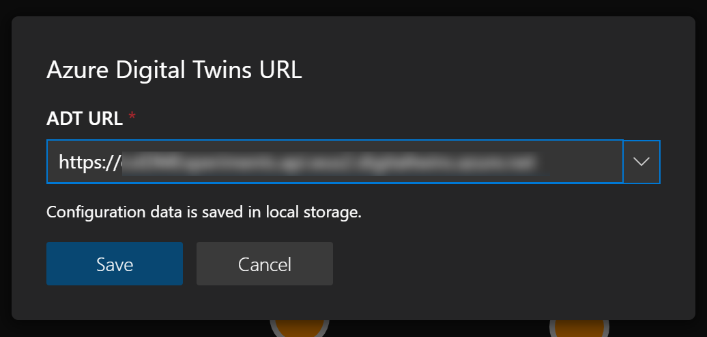
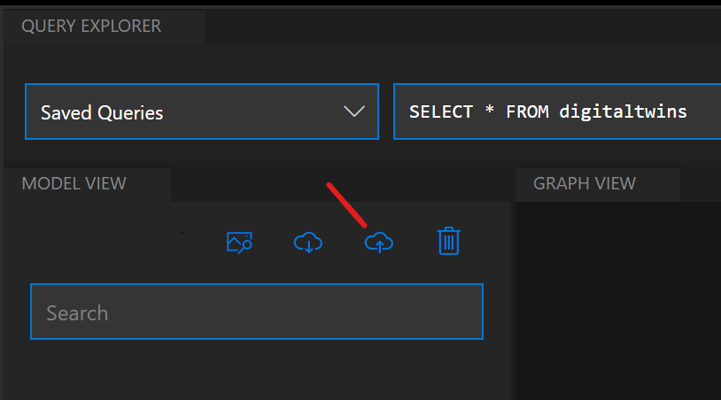
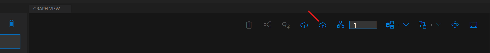
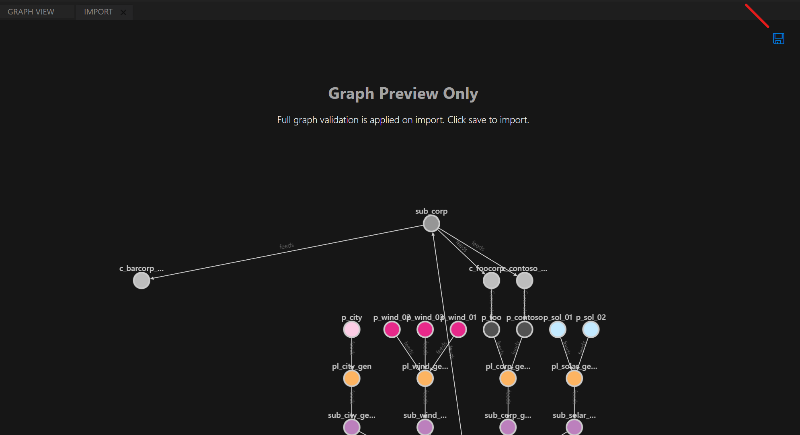
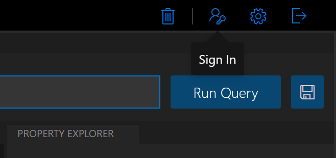
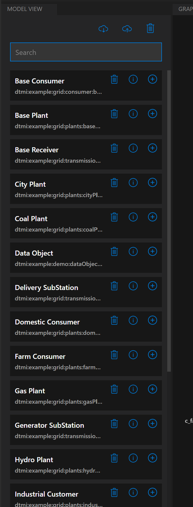
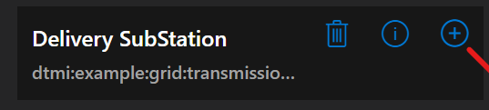
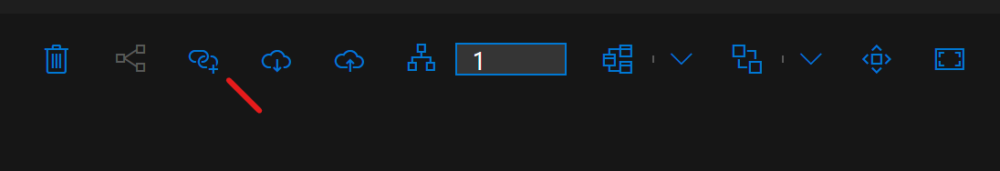
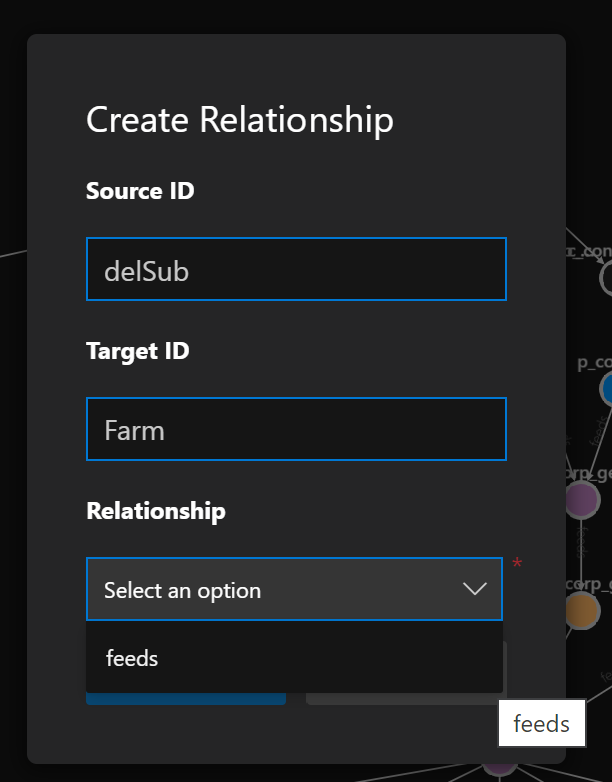

# Azure Digital Twins (ADT) explorer

adt-explorer is a sample application for the [Azure Digital Twins service](https://docs.microsoft.com/azure/digital-twins/overview). It lets you connect to an Azure Digital Twins instance to:
* Upload and explore models 
* Upload and edit graphs of twins
* Visualize the twins graph with a number of layout techniques
* Edit properties of twins
* Run queries against the twins graph 


There is also an experimental set of features that allows you to send push notifications from Azure Digital Twins to the application for close-to-real time updates. 

ADT explorer is written as a single-page JavaScript application. You can run it locally as a node.js application - see instructions below.

ADT explorer is licensed under the MIT license. Please see the Microsoft [Open Source Code of Conduct](https://opensource.microsoft.com/codeofconduct)

## Requirements

Node.js 10+

## Getting Started

### Running adt-explorer locally

1. Set up an Azure Digital Twins service instance with an Azure Active Directory client app registration. For instructions, please see the following how-to articles:
    * [Set up an Azure Digital Twins instance](https://docs.microsoft.com/azure/digital-twins/how-to-set-up-instance)
    * [Authenticate an Azure Digital Twins client application](https://docs.microsoft.com/azure/digital-twins/how-to-authenticate-client). The important part is the creation of the app registration (client id).
      > A few important aspects for your app registrations:
      > * Make sure you add app registrations to the Web platform section of the app registration, not the desktop/mobile section.
      > * When adding callback URLs to the app registration, please make sure to add `http://localhost:3000`. You can run adt-explorer with a different port (see below), but this is the default.
      > * Check the **Access Tokens** toggle in the **Implicit Grants** section a few paragraphs below the **Platform Configuration** section on the page. If this toggle is not checked, you will not get authorization tokens.  
1. From a command prompt in the `client/src` folder, run `npm install`. This will retrieve all dependencies
1. From the same command prompt, run `npm run start`.
    > By default, the app runs on port 3000. To customize the port, change the run command. For example, to use port 8080:
    >  * Linux/Mac (Bash): `PORT=8080 npm run start`
    >  * Windows (cmd): `set PORT=8080 && npm run start`
    > Note: Your ADT app registration must have a reply URL using the same port you are using - e.g. localhost:7000 if that is the port you are using.
1. Your browser should open and the app should appear.

## Quick Start: Create an Example Graph

To create an example graph with adt-explorer connected to a fresh instance of Azure Digital Twins, follow the steps below. The result will be the graph in the screenshot above.

Note: When you click the first command, adt-explorer will open a dialog that prompts you for connection information to your service instance. You will need to provide:
1. The Azure AD client ID configured earlier.
1. The Azure AD tenant ID where the app is defined.
1. The target Azure DT URL.



In the model panel at the left, click the `upload models` button (cloud icon with an arrow pointing into the cloud). 



  * In the file selector box that appears, navigate to the [client/examples](https://github.com/Azure-Samples/digital-twins-explorer/tree/master/client/examples) folder in the repository
  * Select all files with the `*.json` extension and hit ok

Adt-explorer will now upload these model files to your Azure Digital Twins instance

In the graph view panel (the large space in the middle), select the `import graph` button.



In the file selector box, choose the `distributionGrid.xlsx` spreadsheet file. This file contains a description of the desired graph.

An import view opens, showing a preview of the graph that is going to be loaded.

Hit the save button in the upper right corner



Adt-explorer will now create the requested twins and relationships in the service instance. A dialog will appear to show that it is finished.


Click on the graph view tab

Click the large query button in the upper right of the screen. This will cause adt-explorer to retrieve all twins and relationships from the service and draw the graph defined by them. 

For more detailed instructions on adt-explorer features, please see the sections below.

## Using adt-explorer

### First run

Initial authentication is triggered by:
1. Clicking on the sign in button in the top right, or
1. Clicking on an operation that requires calling the service.




Before continuing, you'll need to provide:
1. The Azure AD client ID configured earlier.
1. The Azure AD tenant ID where the app is defined.
1. The target Azure DT URL.


To change these properties at any time, click on the sign in button in the top right.

### Uploading Models

Azure Digital Twins needs to be configured with models representing the entities that are important to your business. If you are using a fresh Azure Digital Twins instance, you should upload some models to the service first.

To upload, browse and delete models, use the model view panel docked on the left side of the screen.


 
The panel will automatically show all available models in your environment on first connection; however, to trigger it explicitly, click on the *Download models* button.

To upload a model, click on the *Upload a model* button and select one more JSON-formatted model files when prompted.

For each model, you can:
1. **Delete**: remove the definition from your ADT environment.
1. **View**: see the raw JSON definition of the model.
1. **Create a new twin**: create a new instance of the model as a twin in the ADT environment. No properties are set as part of this process (aside from name).

The models shown in the example screenshot are available in the `examples` folder in this repository (`client/examples`). 

### Creating Twins and Relationships

You can create twins and relationships in adt-explorer. To create more than a few individual twins and relationships, you will probably want to use the **import** feature described below.

* To create a twin instance, use the (+) button in any of the model items in the model list. A dialog will open, prompting you for the desired name of the new instance. The name must be unique.



* To create a relationship: 
  * You need to have at least two twins in your graph. An appropriate relationship must be defined in the model definition (in other words, the relationship you are trying to create must be allowed in the DTDL of the source twin). 
  * Select the source twin first by clicking on it, then hold the shift key and click the target twin.
  * Click the "Create Relationship" button in the graph viewer command bar




  * Pick the desired relationship type (if any is available) from the popup menu in the relationship dialog



### Querying

Queries can be issued from the *Query Explorer* panel.

To save a query, click on the Save icon next to the *Run Query* button. This query will then be saved locally and be available in the *Saved Queries* drop down to the left of the query text box. To delete a saved query, click on the *X* icon next to the name of the query when the *Saved Queries* drop down is open.

For large graphs, it's suggested to query only a limited subset and then load the remainder as required. More specifically, you can double click on twins in the graph view to retrieve additional related nodes.

To the right side of the *Query Explorer* toolbar, there are a number of controls to change the layout of the graph. Four different layout algorithms are available alongside options to center, fit to screen, and re-run layout.

### Import/Export

From the *Graph View*, import/export functionality is available.

Export serializes the most recent query results to a JSON-based format, including models, twins, and relationships.

Import deserializes from either a custom Excel-based format (see the [examples](https://github.com/Azure-Samples/digital-twins-explorer/tree/master/client/examples) folder for example files) or the JSON-based format generated on export. Before import is executed, a preview of the graph is presented for validation.

The excel import format is based on the following columns:
* ModelId: The complete dtmi for the model that should be instantiated.
* ID: The unique ID for the twin to be created
* Relationship: A twin id with an outgoing relationship to the new twin
* Relationship name: The name for the outgoing relationship from the twin in the previous column
* Init data: A JSON string that contains Property settings for the twins to be created

A few notes for relationships in the excel file. The following row

`dtmi:example:test;1, twin01, twin02, relatesTo, {"Capacity":5}`  

creates a twin instance of type `dtmi:example:test;1` with the id `twin01` and a `Capacity` property set to 5. It will also create a `relatesTo` relationship from a twin instance with the id twin02 to twin01.

In this example, the model `dtmi:example:test;1` actually must define a property named `Capacity` of a numeric data type, and the model type of `twin02` must have a defined relationship `relatesTo`.
  
It is also possible to create multiple relationships to a twin that is being created. To just create a relationship (not a twin instance) simply leave the modelId column empty. 

### Editing twins

Selecting a node in the *Graph View* shows its properties in the *Property Explorer*. This includes default values for properties that have not yet been set.

To edit writeable properties, update their values inline and click the Save button at the top of the view. The resulting patch operation on the API is then shown in a modal.

Selecting two nodes allows for the creation of relationships. Multi-selection is enabled by holding down CTRL/CMD keys. Ensure twins are selected in the order of the relationship direction (i.e the first twin selected will be the source). Once two twins are selected, click on the `Create Relationship` button and select the type of relationship.

Multi-select is also enabled for twin deletion.

### Advanced Settings

Clicking the settings cog in the top right corner allows the configuration of the following advanced features:
1. Eager Loading: in the case the twins returned by a query have relationships to twins *not* returned by the query, this feature will load these missing twins before rendering the graph.
1. Caching: this keeps a local cache of relationships and models in memory to improve query performance. These caches are cleared on any write operations on the relevant components (or on browser refresh).
1. Console & Output windows: these are hidden by default. The console window enables the use of simple shell functions for workign with the graph. The output window shows a diagnostic trace of operations.
1. Number of layers to expand: when double clicking on a node, this number indicates how many layers of relationships to fetch.
1. Expansion direction: when double clicking on a node, this indicates which kinds of relationships to follow when expanding.

## Known Limitations

* adt-explorer does not currently handle complex properties or components defined in twins well. You can create or visualize twins using these features, but you may not be able to view or edit their properties
* The display of patches in the property inspector is not always correct if you perform multiple patches in a sequence. The changes should be correctly applied to th service twin, though

## Experimental Features

In addition to local operation, you can also run adt-explorer as a cloud application. In the cloud, you can use push notifications from Azure Digital Twins, sent via the Azure SignalR service, to update your adt-explorer in real time.

### Running in the cloud

1. Deploy the ARM template called `template.json` located under the `deployment` folder into your Azure subscription.
1. Package the client app using `npm run build`. You may need to set `NODE_OPTIONS=--max_old_space_size=4096` if you receive memory-related errors.
1. From the new `build` file, upload each file to the `web` container in the new storage account created by the ARM template.
1. Package the functions app using `dotnet public -c Release -o ./publish`.
1. Zip the contents of the `./publish` folder. E.g. from within the publish folder, run `zip -r AdtExplorerFunctions.zip *`.
1. Publish the functions app using the CLI: `az functionapp deployment source config-zip -g <resource_group> -n <app_name> --src <zip_file_path>`.
1. [Optional] For each Azure Digital Twins environment used with the tool *where live telemetry through SignalR is required*, deploy the `template-eventgrid.json` template in your Azure subscription.
1. Update your Azure AD client to add a new callback URL for the application (i.e. `https://adtexplorer-<your suffix>.azurewebsites.net/`).

### Advanced

When running locally, the Event Grid and SignalR services required for telemetry streaming are not available. However, if you have completed the cloud deployment, you can leverage these services locally to enable the full set of capabilities.

This requires setting the `REACT_APP_BASE_ADT_URL` environment variable to point to your Azure Functions host (e.g. `https://adtexplorer-<your suffix>.azurewebsites.net`). This can be set in the shell environment before starting `npm` or by creating a `.env` file in the `client` folder with `REACT_APP_BASE_ADT_URL=https://...`.

Also, the local URL needs to be added to the allowed origins for the Azure Function and SignalR service. In the ARM template, the default `http://localhost:3000` path is added during deployment; however, if the site is run on a different port locally then both services will need to be updated through the Azure Portal.

## Extensibility points

### Import

Import plugins are found in `src/services/plugins` directory within the client code base. Each plugin should be defined as a class with a single function:

```ts
tryLoad(file: File): Promise<ImportModel | boolean>
```

If the plugin can import the file, it should return an `ImportModel`. If it cannot import the file, it should return `false` so the import service can share the file with other plugins.

The `ImportModel` should be structured as follows:

```ts
class DataModel {
  digitalTwinsFileInfo: DataFileInfoModel;
  digitalTwinsGraph: DataGraphModel;
  digitalTwinsModels: DigitalTwinModel[];
}

class DataFileInfoModel {
  fileVersion: string; // should be "1.0.0"
}

class DataGraphModel {
  digitalTwins: DigitalTwin[]; // objects align with structure returned by API
  relationships: DigitalTwinRelationship[]; // objects align with structure returned by API
}
```

New plugins need to be registered in `ImportPlugins` collection at the top of the `src/services/ImportService.js` file.

Currently, import plugins for Excel and JSON are provided. To support custom formats of either, the new plugins would need to be placed first in the `ImportPlugins` collection or they would need to be extended to detect the custom format (and either parse in place or return `false` to allow another plugin to parse).

The `ExcelImportPlugin` is designed to support additional Excel-based formats. Currently, all files are parsed through the `StandardExcelImportFormat` class; however, it would be relatively straightforward to inspect cell content to detect specific structures and call an alternative import class instead.

### Export

Graphs can be exported as JSON files (which can then be re-imported). The structured of the files follows the `DataModel` class described in the previous section.

Export is managed by the `ExportService` class in `src/services/ExportService.js` file.

To alter the export format structure, the existing logic within the `ExportService` to extract the contents of the graph could be reused and then re-formatted as desired.

### Views

All panels are defined in the `src/App.js` file. These configuration objects are defined by the requirements of the Golden Layout Component.

For temporary panels within the application (e.g. import preview), two approaches can be considered:
1. For panels like output & console, the new panel can be added to the `optionalComponentsConfig` collection. This allows the panel's state (i.e. open or closed) to be managed through the app state, regardless of whether it is closed via the 'X' on the tab or when it is closed via configuration (like available in the preferences dialog).
1. For panels like import preview, these can be manaully added on demand to the layout. This can be cleanly done via the pub/sub mechanism (see below and the `componentDidMount` method in `App.js`).

### View commands

Where a view has commands, it's suggested that a dedicated command bar component is created (based on components like that found in `src/components/GraphViewerComponent/GraphViewerCommandBarComponent.js`). These leverage the Office Fabric UI `CommandBar` component and either expose callbacks for functionality via props or manage operations directly.

### Pub/Sub

The Golden Layout Component includes a pub/sub message bus for communication between components. This is key part of the ADT Explorer and is used to pass messages between components.

All events - via publish and subscribe methods - are defined in the `src/services/EventService.js` file. Additional events can be defined by adding to this file.

The pub/sub message bus is not immediately available on application load; however, the event service will buffer any pub or sub requests during this period and then apply them once available.

## Services

### Local

When running locally, all requests to the ADT service are proxied through the same local web server used for hosting the client app. This is configured in the `client/src/setupProxy.js` file.

### Cloud

When running in the cloud, Azure Functions hosts three services to support the front end application:
1. Proxy: this proxies requests through the ADT service (much in the same way as the proxy used when running locally).
1. SignalR: this allows clients to retrieve credentials to access the SignalR service for live telemetry updates. It also validates that the endpoint and route required to stream information from the ADT service to the ADT Explorer app is in place. If the managed service identity for the Function is configured correctly (i.e. has write permissions on the resource group and can administer the ADT service), then it can create these itself.
1. EventGrid: this receives messages from the Event Grid to broadcasts them to any listening clients using SignalR. The messages are sent from ADT to the function via ADT endpoint and route.
